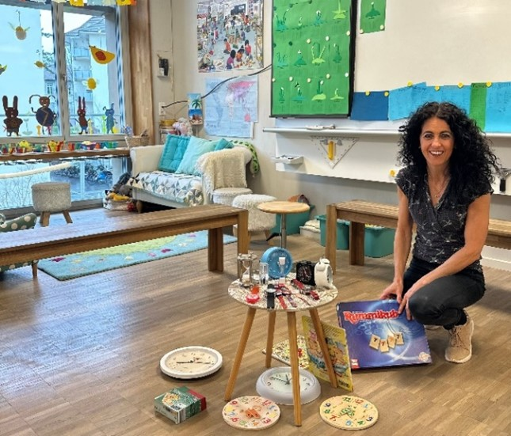
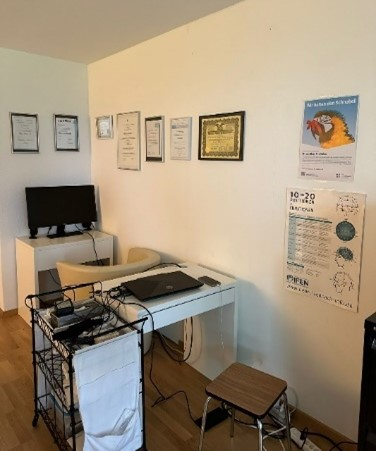

+++
title = "ADHS im Rampenlicht: „Das Puzzle des Lebens und des Umgangs mit ADHS aus verschiedenen Perspektiven“"
date = "2024-05-29"
draft = false
pinned = true
tags = ["Deutsch", "Reportage"]
image = "gehirn.jpg"
description = "ADHS wird durch Symptome wie Unaufmerksamkeit, Hyperaktivität und Impulsivität gekennzeichnet und durch eine klinische Bewertung mittels Interviews und Fragebögen diagnostiziert."
+++
 **In einer Gesellschaft, die Konzentration und Aufmerksamkeit schätzt, bleiben diejenigen, die mit ADHS leben, oft im Schatten. Doch hinter diesem Verhalten verbirgt sich eine komplexe Realität: Die Herausforderungen der Aufmerksamkeitsdefizit-Hyperaktivitätsstörung (ADHS). Begleiten Sie uns auf eine kleine Reise der Diagnose ADHS, von anfänglichem Missverständnis hin zur Erkenntnis, dass jede Geschichte einzigartig ist und neue Perspektiven aufdeckt.** 

Von **Dalia Sretenovic und Cindy Nilovic**

##### Schulhausatmosphäre

Die letzten Kinder stürmen aus dem Schulhaus in den Hof hinaus und die Tür schließt sich. Quietschend geht die Glastüre wieder auf und ein Einblick auf die gelbgestrichenen Wände, verziert mit vielen Kinderzeichnungen, die sofort ins Auge fallen, ergibt sich. Vor dem Klassenzimmer stehend, kommen alte Erinnerungen wieder hoch und der erste Einblick ins Zimmer zaubert ein breites Lächeln ins Gesicht. Empfangsfreudig steht Madeleine Quinche, die Klassenlehrperson der 1./2. Klasse, in ihrem Klassenzimmer und somit fügt sich das Bild zusammen. Madeleine Quinche zeigt auf einen kleinen, runden Holztisch, welcher zentral vor der Wandtafel des Schulzimmers platziert ist. Darauf sind viele verschiedene Uhren, sowohl Sanduhren als auch analoge Uhren schön für die Schüler als Lernzweck aufgestellt.
*«Die Uhrzeit zu lesen und ein Zeitgefühl zu entwickeln, wird von den Schülern auf verschiede Arten fleißig gelernt.»*
Dies zu erlernen, gehört zum Lernplan der Zweitklässler.

##### Der Blick einer erfahrenen Lehrerin

Seit 30 Jahren geht Madeleine ihrem Traumberuf, Klassenlehrperson zu sein, nach. Leidenschaftlich unterrichtet sie am Manuel-Schulhaus in Muri. Durch ihre lange pädagogische Erfahrung kennt sie sich mit ADHS-betroffenen Schülern sehr gut aus. Wie, Madeleine berichtet, könne sie wahrscheinlich schon nach den ersten paar Schultagen aussagen, wer von der neurobiologischen Diagnose betroffen sein könnte. Schon im *«Morgenkreis»* fällt ein Kind mit ADHS schnell auf, denn die Klassenlehrerin bemerkt unmittelbar die innere Abwesenheit oder Unaufmerksamkeit des Kindes. Durch Zappeln, Selbstablenkung, Koordinationsmühe und Distanzmühe fällt die hyperaktive Seite des ADHS an den Kindern auf. Madeleine fördert die Unterstützung im jungen Alter, um Schwierigkeiten für das spätere Leben zu minimieren. So wie Madeleine schildert: *«Ich kann schnell mit gewissen Hilfestellungen eingreifen, zum Beispiel mit Bewegungsspielen, damit es nicht ausartet. Zudem soll die Lernatmosphäre still und ruhig sein. »* Madeleine ist bewusst, was für eine Verantwortung sie trägt und weiss, dass es an ihr liegt, wie das Kind später damit umgehen kann, da manche Eltern sich nicht offen über dieses Thema austauschen wollen oder nicht präsent sind. Vor allem die jüngeren Kinder sind viel mit sich selbst beschäftigt und merken es nicht, wenn ihr Mitschüler ADHS hat. Das hilft den Kindern mit ADHS. 

##### ADHS-Förderung und Unterstützung

Wie Madeleine aussagt: *« Man soll nicht alle Kinder mit ADHS in einen Topf werfen.»* Sie will damit bezwecken, dass man ADHS mit vielen Strategien unterstützt und es je nach Kind variiert. Madeleine legt grossen Wert darauf, dass Kinder mit ADHS nicht anders behandelt werden als andere Kinder. Jedoch ist sie stets offen für individuelle Unterstützung und Förderung. Da zeigt Madeleine auf eine kleine türkisfarbene Kiste, die als *«Tigerkiste»* bekannt ist, welche als Leistungsförderung der schnelleren Schüler dient. Grösstenteils bedienen sich Kinder mit ADHS, die ein gewisses Niveau in Mathe aufweisen. Madeleine ermöglicht jedoch allen Zugriff auf die Kiste. Wie Madeleine aus ihrem Herzen heraus spricht: *«Kinder mit ADHS, mit denen man am meisten zu tun hatte, sind genau die Kinder, die man nie vergisst. Das sind die, die dir Jahre später auf der Strasse zuwinken und dich begrüssen. Das kommt daher, dass man viel Zeit und Energie in sie investiert hat.»* Abschliessend erzählt Madeleine, dass es wichtig sei die Puzzleteile zu einem Bild zusammenzusetzten, damit man das betroffene Kind richtig fördert, da es eine grosse Palette an Auffälligkeiten der Aufmerksamkeitsdefizithyperaktivitätsstörung gibt. Was jedoch kein Kind hindert, ist, eine neue Tür zu öffnen, wenn sich eine andere schliesst.

##### ADHS im jungen Alter und die Folgen in der Schulkarriere

Gehen wir ein paar Jahre zurück, Timo Hildebrandt, Erstklässler der Primarstufe, kämpft mit der Konzentration. Anfangs dachte man, dass er sich in einer Entwicklungsphase befindet und es normal sei, dass Kinder in seinem Alter etwas aktiver sind. Deshalb machte man sich zunächst keine großen Gedanken darüber. Schliesslich tritt die Vermutung auf, dass er auf dem ADHS-Spektrum sein könnte. Geht durch diese Vermutung für Timo die Welt unter? Nein, mit seinen sieben Jahren nimmt er diese neue Information nicht wirklich auf und lässt sich auch von seinen Mitschülern nicht unterscheiden. Während er auf dem Pult sitzt, wirft Timo einen Blick auf die grossen Fenster des Klassenzimmers. Ein fliegender Vogel weckt sein Interesse und der Unterricht im Hintergrund verschwimmt. Plötzlich ertönt das Klingeln, welches das Ende der Stunde ankündigt und Timo erwacht aus seiner verträumten und unkonzentrierten Welt.

##### Medikamentöse Behandlung

Letzten Endes musste man medikamentös mit *«Ritalin»* und *«Elvanse»* eingreifen, was dazu geführt hat, dass Timo im jungen Alter folgende Erfahrungen gemacht hat: *« Als ich die Medikamente zu mir nahm, war ich vollkommen in meiner Welt, habe mich distanziert, war weniger kommunikativ, hatte weniger Appetit und es veränderte meine Persönlichkeit.»* 
Timo nimmt das Medikament zu sich und nach kurzer Zeit, steigt seine Konzentration drastisch. Ohne Einnahme ist es für ihn schwierig den ganzen Inhalt, den er gelernt hat, wieder abzurufen. Doch im Laufe der Zeit ist ADHS immer weniger ein Thema und wurde immer mehr von seinem Umfeld akzeptiert. 

 Medikamente wie Ritalin, können die Hirntätigkeit stimulieren. Es wirkt anregend für die Konzentration, unterdrückt Müdigkeit und wirkt leistungssteigernd. Was je nachdem zum Vorteil der ADHS-Betroffenen führt.

Quelle: [https://www.netdoktor.ch/medikamente/ritalin ](https://www.netdoktor.ch/medikamente/ritalin/)

##### Die Auswirkung von ADHS auf das Umfeld

Wie Timo beschreibt: *«Durch die viele Energie, die ich habe und die aufgestellte Art, wirke ich positiv auf aussenstehende Menschen, meinen Freundeskreis und meine Familienmitglieder, da ich eine gewisse Ausstrahlung habe.»* Ob es das ADHS ist, oder seine Persönlichkeit widerspiegelt, kann er nicht sagen. Timo wurde die ADHS-Diagnose nie wirklich zugesprochen. Seinem Umfeld und ihm war es klar, dass er teilweise hyperaktiv und unkonzentriert bei einem Gespräch zu scheinen mag und man hatte es nie gross thematisiert. Doch die Symptome waren früher ausgeprägter als heutzutage. 

##### Rat an ADHS-Betroffene

Timo gibt den ADHS-Betroffenen einen wichtigen Rat: *« Verstell dich nicht. Versuche nicht, die Diagnose vor anderen Leuten zu verstecken und betrachte es nicht als ein Handicap. Du bist so wie du bist, auf deine eigene, individuelle Art. Jeder hat seine Schwächen und Stärken. Akzeptier dich und deine Situation, denn mit dem muss man lernen umgehen zu können. Die richtigen Leute, die bleiben in deinem Leben und die nehmen dich so, wie du bist.»* Timo rät ab, Medikamente gegen ADHS zu nehmen, ausser es ist unumgänglich. Denn es verändert die eigene Persönlichkeit und die Herangehensweise an verschiede Konflikte und Situationen im Leben. Ein grosses Missverständnis, welches Timo klären will ist, dass viele Menschen denken, dass man sich nur so verhält, um Aufmerksamkeit zu bekommen. Denn dies ist nicht der Fall. Er wünscht sich einen verständnisvollen Umgang und eine offene Kommunikation untereinander. *« Denn ich bin nicht krank, sondern so, wie ich bin. ADHS ist Teil meines Lebens.»* Wenn Timo einige Jahre zurück in die erste Klasse denkt, erkennt er, wie viel er tatsächlich erreicht hat. 

##### Diagnose von ADHS

Die Wände des leeren Wartezimmers von Frau Aeschbach sind in strahlendem Weiss gestrichen, doch sobald sich die Tür öffnet, enthüllt sich ein gemütlich eingerichtetes Zimmer mit einem auffällig orangefarbenen Sofa. Nach der herzlichen Begrüssung erklärt die erfahrene ADHS-Expertin, die viele Menschen mit ADHS betreut, dass ADHS nicht wirklich ein Problem oder Hindernis ist, sondern vielmehr eine Art Begleitung im Leben darstellt. Denn alles hat einen Anfang. ADHS wird psychiatrisch diagnostiziert, bestehend aus einem Gespräch und Fragebögen, welche dem Alter angepasst sind. Im Idealfall holt man eine Lehrkraft dazu, damit man das Umfeld miteinbezieht. Laut der Spezialistin muss das Kind nicht nur in der Schule, sondern auch zu Hause auffällig sein. ADHS wird in drei Kategorien eingestuft, die Aufmerksamkeit, Impulsivität und die Hyperaktivität. Zu diesen Kategorien werden gezielte Fragen gestellt, sodass ADHS diagnostiziert werden kann. Damit das Kind eine Diagnose erhält, muss es bestimmte Kriterien zur Verhaltensweise erfüllen. Bei Kindern ist es üblich, eine Neuropsychologische Abklärung vornehmen zu lassen, welche aber nicht zwingend für die Diagnose nötig ist.

##### Trotz ADHS, bewundernswerte Konzentration in Krisensituationen

Fasziniert erläutert Frau Aeschbach, wie gut eine ADHS-betroffene Person in Krisensituationen arbeiten könne, wie beispielswiese in der Notfallchirurgie oder dem Rettungsdienst, wobei ihnen ihre genetisch bedingte Störung in diesen Fällen keine Steine in den Weg legt. Auf die Frage, wie man ADHS behandeln kann, beschreibt uns Frau Aeschbach den Behandlungsprozess von Neurofeedback: *« Mit Neurofeedback, auch das Hirntraining genannt, versucht man die Wellen im Hirn zu steuern, damit die Betroffenen weniger nervös sind. Das Ziel ist es, die Diagnose zu verstehen und lernen damit umzugehen.»* 

##### Soll man bei ADHS medikamentös eingreifen?

Mit voller Überzeugung stimmt Frau Aeschbach unserer Aussage zu, als wir davon ausgegangen sind, Medikamente bei einer Behandlung einzunehmen. Wie Frau Aeschbach erzählt: *«Grundsätzlich empfehle ich gerne Medikamente, sofern sie jedoch gut dosiert und begleitet sind.»* Die Meinungen erstrecken sich auf einer grossen Bandbreite. Man unterscheidet zwischen denen, die medikamentöse Eingriffe meiden, sowie Timo Hildebrandt diese Meinung teilt, da er schlechte Erfahrungen damit gemacht hat. Anderseits bevorzugt Frau Aeschbach eine Behandlung mit Medikamenten, bei korrekter Dosierung. 

##### Umgang und Unterstützung, wie beeinflusst das die Betroffenen?

Nicht nur Medikament, sondern auch Unterstützung und Verständnis der Eltern erhofft sich eine ADHS-betroffene Person. Leider ist dies nicht selbstverständlich und manche Lehrer haben einen schlechten Umgang mit ADHS-Betroffenen und werfen ihnen vor, faul zu sein. Wie im Buch *«Die 1% Methode minimale Veränderung, maximale Wirkung»* von James Clear steht, ist, dass bei entsprechender Motivation jeder fleissig sein könne. Entscheidend ist, ob man dabeibleibt, wenn die Tätigkeit nicht spannend ist.
Wie Frau Aeschbach theatralisch nachahmt: *«Du könntest dir schon mehr Mühe geben, wenn du es wollen würdest.»* Und das eigentliche Problem dieses Vorwurfs ist, dass es nichts ändert, da sie es nicht absichtlich machen und es ihnen durchaus schwerfällt, mitzumachen. Daher erhofft sich Frau Aeschbach Verständnis, um genau diesen Schülern Halt zu geben. Da man heutzutage mehr über ADHS weiss, holt man sich frühzeitig Hilfe und entwickelt ein gewisses Verständnis der Diagnose und den Betroffenen gegenüber. 

##### ADHS hat auch gute Seiten

Nicht nur sozial, sondern auch wissenschaftlich werden Fortschritte gemacht, spezifisch bezogen auf Neurofeedback. Jedoch ist das Allerwichtigste die Selbstmotivation, die einen ADHS-Betroffenen schliesslich zum Ziel führt. Frau Aeschbach assoziiert dieses Verhalten mit einem Motor, der eine gewisse Zeit braucht, bevor er anspringt. Abschliessend betont Frau Aeschbach, dass es nicht unbedingt notwendig sei, ab einem gewissen Alter eine Diagnose gestellt zu bekommen. Das eigentliche Ziel ist es, herausfinden, wer man genau ist. Wie James Clear im Buch beschreibt: *«Wer sie sind, können Sie am einfachsten ändern, wenn sie ändern, was Sie tun»* Letzten Endes erläutert Frau Aeschbach, wie sehr sie die ADHS-Betroffenen bewundert, da sie wie ein Licht die Gesellschaft erleuchten und die Probleme sie davon nicht abhalten. Auch wenn man ungeduldig im Wartezimmer auf Verständnis und Unterstützung hofft, erlischt das Fünkchen Licht noch lange nicht.